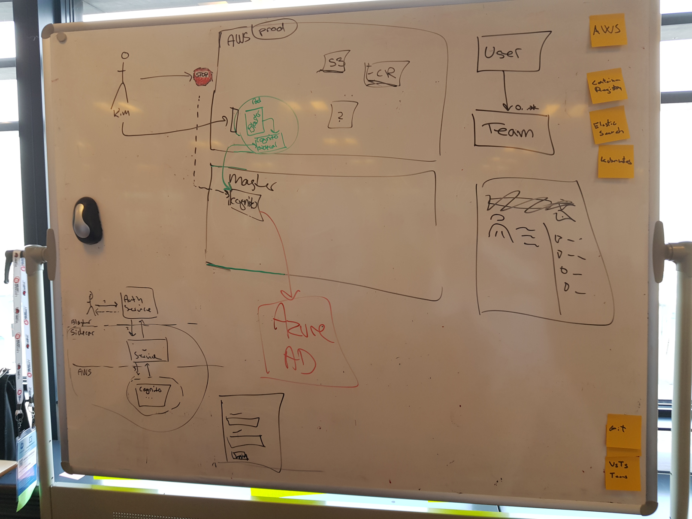
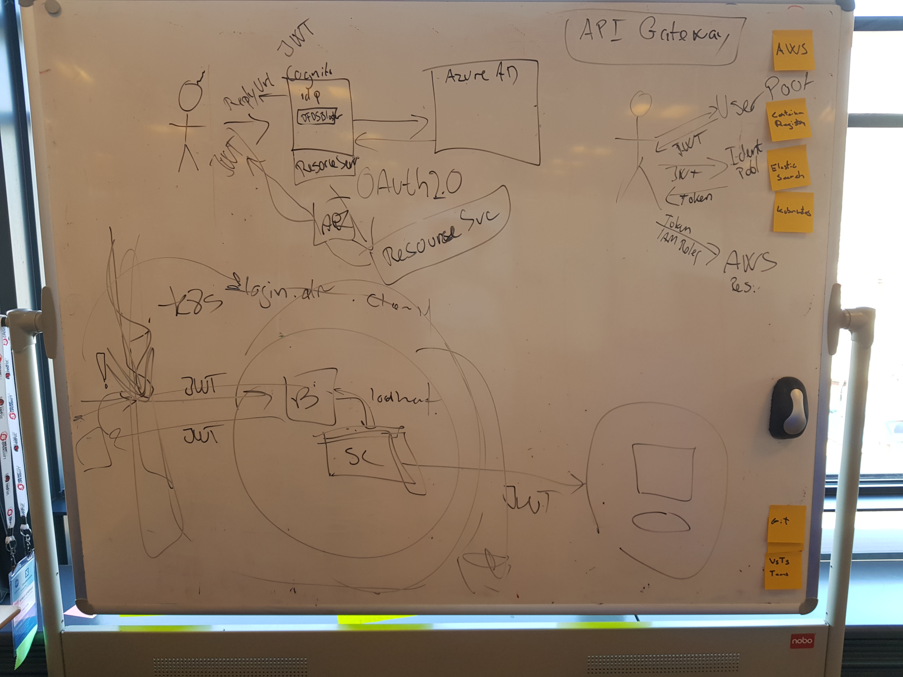
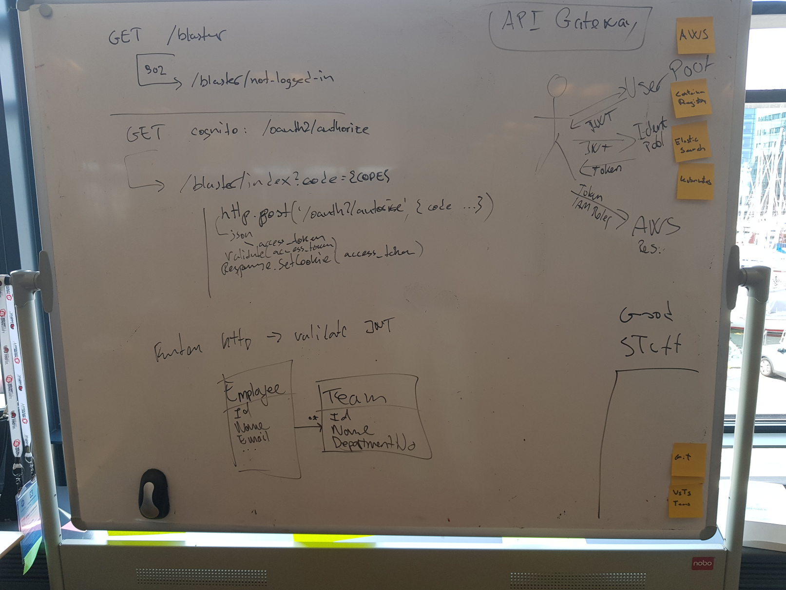
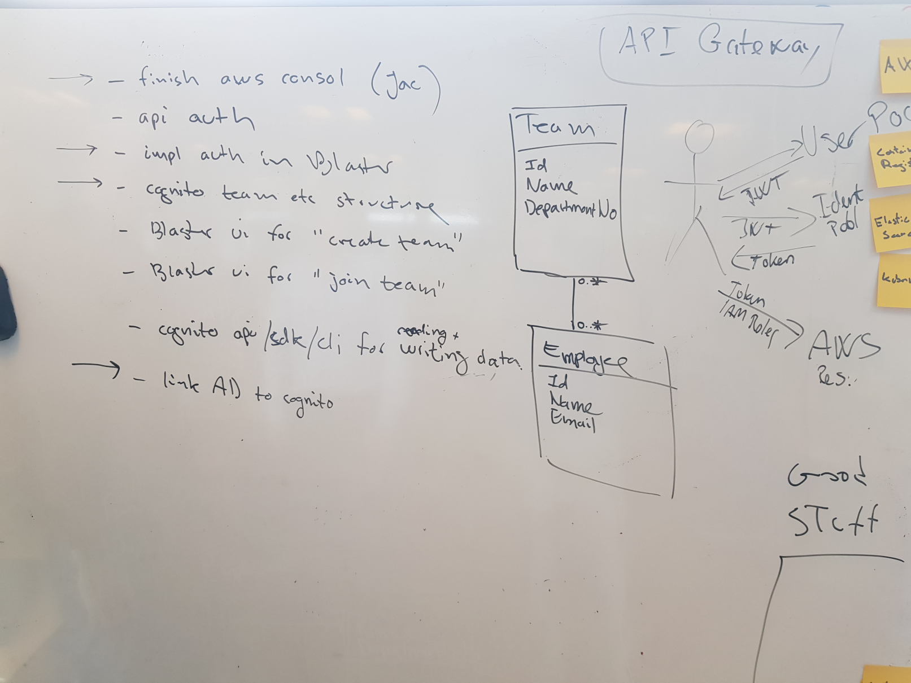
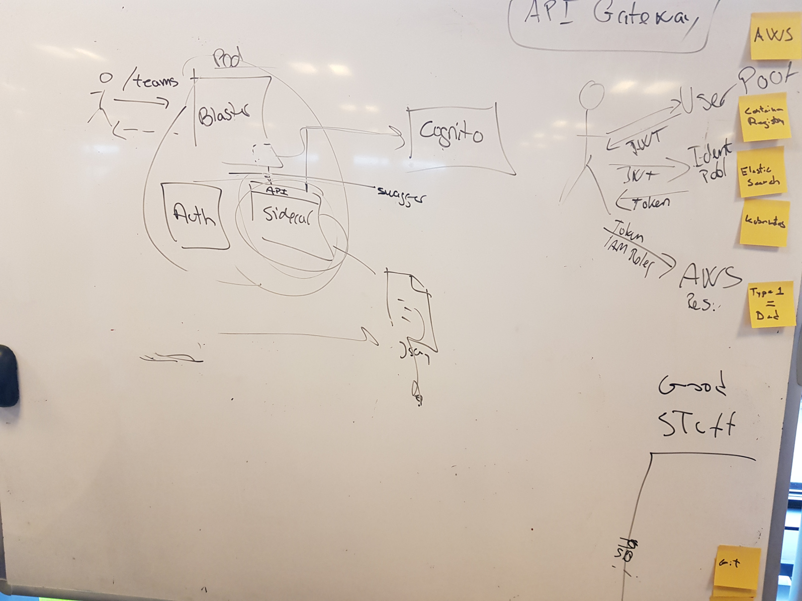
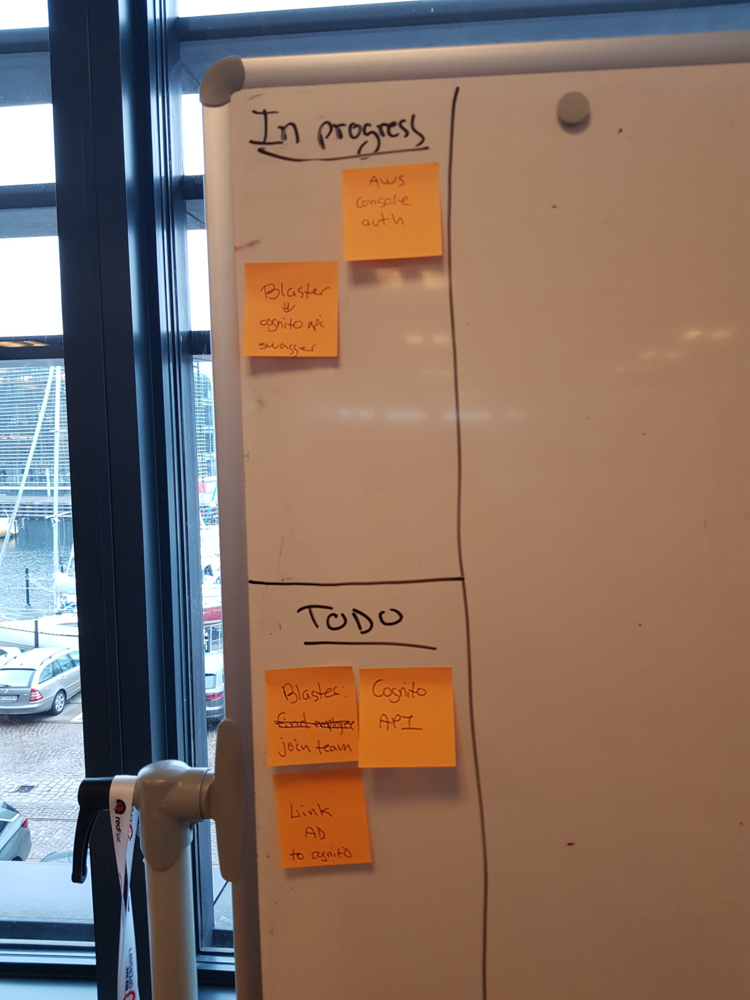

# 2018-09-04

## Context
Today we have to manually create users and IAM roles every time a developer wants to make use of our platform.
## Challenge  
Find a way to automate creation of users.

### Refinement of challenge
Create a one click way of assigning a AIM role

### Descoped 
* Assign user to team
* User login for Blaster

https://askubuntu.com/questions/17536/how-do-i-create-a-permanent-bash-alias
## Thoughts
We believe AWS Cognito can help us.

# 2018-09-05

## Thoughts
Cognito can do user management for us. 
Using the token we get from Cognito in .net core is a hassle
Cognito can map user groups directly to IAM Roles

# 2018-09-06

## Tasks identified
* IAM integration
* Implement auth in Blaster
* Research Cognito team structure
* Blaster UI for "Create team"
* Blaster UI for "Join team"
* .net sdk implementations of create and join team

## Thoughts
You can do the following in Cognito: Create a empty team, assign a user to a group (a group could be a team)
You can not nest groups

### Descoped
* Auth in API

# 2018-09-07
## Descoped
* Put the OAUTH work in a proxy in front the service that needs protection. 
## Thoughts
We could make a small proof of consept project that demonstrate how a .net app would talk with Cognito 
## Work division
Jacob is still on the IAM integration
Jens will continue implementing auth in Blaster, this includes adding variables to the deploy pipeline
Kim will write a architect decision record

# 2018-09-10
## Descoped
* Provision of Cognito with Terraform
* Backup of Cognito

## Thoughs
Good read about OAUTH2 and .net:

https://www.jerriepelser.com/blog/authenticate-oauth-aspnet-core-2/

https://lbadri.wordpress.com/2018/02/25/asp-net-core-2-0-oidc-authentication-using-aws-cognito/

https://rafpe.ninja/2017/07/30/net-core-jwt-authentication-using-aws-cognito-user-pool/

# 2018-09-11

## Decision
We will create a Cognito API that will be a abstract implementation of the AWS Cognito service. We will mount the API as a sidecar to the Blaster&trade;
## Work division
Jens makes a API Contract
Kim Writes a Cognito API
Jacob is still on the IAM integration (he has working code, hope he shares soon) 

## Thoughs
There is a limit of 25 groups (what we wish to use as a team) pr user poll.
See other limits here: https://docs.aws.amazon.com/cognito/latest/developerguide/limits.html

We started a  micro board to keep track of the state of the project

